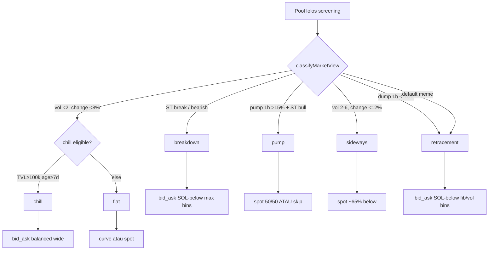

# Cheat Sheet: Kondisi Pasar → Strategi Meteora → Meridian

Referensi cepat 1 halaman. Config live per 2026-07-16 (`user-config.json`).

---

## 1. Tiga bentuk distribusi Meteora (UI)

| Bentuk | Likuiditas | Kapan dipakai | Risiko utama |
|--------|------------|---------------|--------------|
| **Spot** | Merata di range | Sideways, gak yakin arah | OOR kalau breakout |
| **Curve** | Tumpuk di tengah (active bin) | Stable / low vol | OOR kalau trending kuat |
| **Bid-Ask** | Tumpuk di **kedua ujung** | Volatil, punya view arah | Perlu rebalance; single-sided = DCA |

**Single-sided SOL** = deposit cuma SOL di bawah harga → otomatis beli token saat dump + earn fee.

---

## 2. Matrix utama — kondisi → bot deploy



| Market view | Trigger (router) | Meteora shape | Meridian deploy | Deposit |
|-------------|------------------|---------------|-----------------|---------|
| **breakdown** | Supertrend bearish / support break | Bid-Ask wide below | `bid_ask` | SOL below only, bins↑ (max ~200) |
| **pump** | 1h >+15% + ST bullish | Spot balanced | `spot` 50/50 | **BLOCK** jika pump > **15%** cap |
| **chill** | vol<2, TVL≥$100k, umur≥7d | Bid-Ask balanced wide | `bid_ask` balanced | Mapán token only |
| **flat** | vol<2, perubahan harga kecil | Curve / Spot | `curve` atau `spot` | Low vol fee harvest |
| **sideways** | vol 2–6, 1h change <12% | Spot bias bawah | `spot` ~65% bins below | Range-bound |
| **retracement** | dump 1h <-15% atau default | Bid-Ask SOL below | `bid_ask` | Evil Panda / LogicalTA play |

**Bins:** `minBinsBelow=90`, `default=130`, `max=200` — deploy ditolak jika total < 90.

---

## 3. Entry gates (kenapa lolos screening tapi gagal deploy)

| Gate | Setting live | Arti |
|------|--------------|------|
| **1h pump cap** | `autoStrategyMaxPumpPct1h: 15` | Jangan chase — tunggu retrace |
| **Spot fee floor** | `autoStrategySpotFeeTvlMin: 2` | Spot butuh fee/TVL ≥2% (exposure token) |
| **Min bins** | `minBinsBelow: 90` | Range terlalu sempit = reject |
| **SOL regime** | `solDump1hPctThreshold: -3` | Skip siklus kalau SOL dump >3% /1h |
| **Top10** | `maxTop10Pct: 50` | Konsentrasi holder |
| **Bot holders** | `maxBotHoldersPct: 35` | Jupiter audit bots |
| **Theme** | trump/musk/barron/melania | Hard block nama |

---

## 4. Screening — pool layak masuk radar

| Metrik | Threshold live | Catatan LP Army / mage |
|--------|----------------|------------------------|
| Timeframe | `30m` | Volume/fee diukur per window ini |
| TVL | $6k – $2M | Bukan profit signal — cuma kapasitas |
| Volume 30m | ≥ $1k | Naikkan ke $10k kalau pindah TF 1h |
| Fee/active-TVL | ≥ 0.1 | **Pilar terkuat** — efisiensi modal |
| Mcap | $80k – $5M | Terlalu kecil = junk; terlalu besar = ANSEM |
| Organic | ≥ 70 | Kualitas flow |
| Umur token | ≥ 4 jam | `minTokenAgeHours` |
| Bin step | 10 – 125 | Kecil = presisi; besar = range lebar |
| Global fees (Jup) | ≥ 8 SOL (+ scaled mcap) | Anti-bundled/scam |

**Sinyal eksternal:** Discord merge + gacor wallet → **harus lolos pre-check Meteora** sebelum masuk antrian.

---

## 5. Management — setelah open

| Event | Setting live | Aksi bot |
|-------|--------------|----------|
| Stop loss | `-8%` | Close |
| Emergency | `maxLossPct: -12%` | Hard backstop |
| Take profit | `+4%` | Close (setelah min age 10m) |
| Trailing | trigger +2%, drop -1% | Lock profit |
| OOR wait | 10 menit | Baru close (kecuali aturan matrix) |
| Rebalance | min vol $1k, cooldown | Reshape/flip kalau enabled |
| Loss redeploy | min loss **0.1%**, cooldown 8h | Dust loss gak ke-block lagi |
| Win redeploy | cooldown retrace | SOLdiers pattern |

---

## 6. Playbook manual (komunitas) vs bot

| Play (X / LP Army / Evil Panda) | Bot otomatis? |
|----------------------------------|---------------|
| Fib 0.51→100 bins, 0.27→200 bins | Partial — `fibHint` di breakdown/retracement |
| Supertrend support break = exit | Partial — ST break → breakdown view; exit via trailing/SL |
| RSI(2)>90 + BB upper = exit | Belum full auto — indikator 15m dipakai classify |
| Evil Panda wide -90% range | `bidAskWideRangeEnabled` + young 90% / mature 65% downside |
| Compounding fees (claim→reinject) | Claim ON; auto compound layer belum default |
| Bid-Ask flip (SOL→token side) | Reshape/flip ON — manual policy via management agent |

---

## 7. Decision cepat — "deploy atau skip?"

```
✅ DEPLOY candidate kuat:
   fee/TVL tinggi + vol moderate + 1h pump <15% + ST belum break down
   + top10 <50% + lolos rugcheck + bins ≥90

⏸️ TUNGGU:
   pump 1h >15% | SOL dump regime | cooldown token/pool aktif
   | fee/TVL spot <2% untuk strategi spot

❌ SKIP:
   theme block | mcap junk/whale | rugcheck fail | wash volume
   | chase pump | bins <90 | bot holders >35%
```

---

## 8. Sumber belajar

- Resmi: https://docs.meteora.ag/ · https://meteoraag.medium.com/dlmm-new-dynamic-liquidity-protocol-to-boost-lp-fees-on-solana-84867bad0907
- LP Army ID: https://www.lparmy.com/academy
- Internal: `METEORA_LP.md`, `LP_ARMY_ACADEMY.md`, `DLMM_RESEARCH_mage.md`

---

*Generated for Meridian ops — update when `user-config.json` atau `strategy-router.js` berubah.*